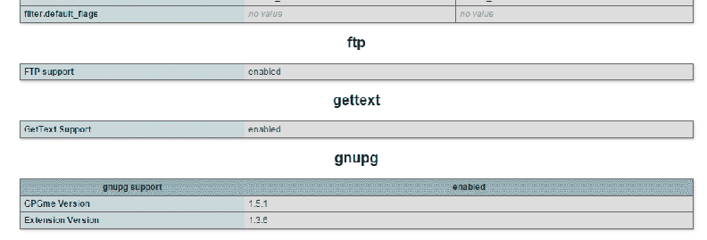

# 2fa-pgp
2-Factor-Authentication for the Web with PGP

Wrapper around the GnuPG extension for PHP to make 2-Factor-Authentication with PGP as easy as possible.

<b>Root access to the server is necessary to install the extension!</b>

### How to install the GnuPG PHP Extension
#### 1. Install required packages
```bash
apt-get install build-essential libssl-dev
apt-get install gnupg libgpg-error-dev libassuan-dev
apt-get install php5-dev php-pear
```
#### 2. Download and build GPGME
Go to https://www.gnupg.org/download/ and download the latest GPGME tarball to a writable directory.
Example (replace X.X.X with current version number):
```bash
wget https://www.gnupg.org/ftp/gcrypt/gpgme/gpgme-X.X.X.tar.bz2
```
Then extract the archive and cd to the new directory:
```bash
tar xfvj gpgme-X.X.X.tar.bz2
cd gpgme-X.X.X
```
Configure, make and install GPGME:
```bash
tar xfvj gpgme-X.X.X.tar.bz2
configure
make
make install
```
#### 3. Install the PHP extension:
```bash
pecl install gnupg
```
Open your php.ini and add 'extension=gnupg.so':
```bash
extension=gnupg.so
```
#### Done!

If everything works fine, you should be able to see a new entry in your phpinfo():

